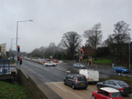

---
# 
layout: default
title: Intelligent Transport Systems (ITS) | Traffic Watch Northern Ireland | nidirect
permalink: intelligent-transport-systems-its
---

# Intelligent Transport Systems (ITS)

Intelligent Transport Systems (ITS) is the collective name given to a range of systems and services which enhance the movement of people and goods by optimising effective management of the road infrastructure and the provision of reliable and timely travel information.

        

          
             <h2>Our policy on ITS states:</h2>
    <blockquote>
    "Transport NI is committed to the application of Intelligent Transport Systems (ITS) for the enhancement of road safety, the effective management of the road network and the provision of traffic and travel information."
        <a href="http://trafficwatchni.com/en/c/document_library/get_file?uuid=3454e594-3296-412f-bc8f-cb12dc959d97&groupId=10621">
        <footer>ITS Strategy Update 2009 - 2015 Document</footer>
        </a>
    </blockquote>
          
<a class="btn btn-default" href="http://trafficwatchni.com/en/c/document_library/get_file?uuid=3454e594-3296-412f-bc8f-cb12dc959d97&groupId=10621" role="button">View full document »</a>

        
<!-- /.col-lg-4 -->
        

          
          <h2>Heading</h2>
          
Duis mollis, est non commodo luctus, nisi erat porttitor ligula, eget lacinia odio sem nec elit. Cras mattis consectetur purus sit amet fermentum. Fusce dapibus, tellus ac cursus commodo, tortor mauris condimentum nibh.

          
<a class="btn btn-default" href="#" role="button">View details »</a>

        
<!-- /.col-lg-4 -->
        

          
          <h2>Heading</h2>
          
Donec sed odio dui. Cras justo odio, dapibus ac facilisis in, egestas eget quam. Vestibulum id ligula porta felis euismod semper. Fusce dapibus, tellus ac cursus commodo, tortor mauris condimentum nibh, ut fermentum massa justo sit amet risus.

          
<a class="btn btn-default" href="#" role="button">View details »</a>

        
<!-- /.col-lg-4 -->
      

	
## Transport NI Key Objectives for ITS
To benefit all road users with regard to improving road safety, effectively managing the road network and improving the environment.

To provide credible, reliable and timely traffic information.

Together with our road authority partners in GB, the Republic of Ireland, and mainland Europe, play an active role in the EU part funded EASYWAY project.
	
To work with other Agencies and Stakeholders to provide improved levels of service with regard to:
* Promoting sustainable modes of transport.
* Providing for vulnerable road users.
* Promoting modal shift to public transport.
* Improving air quality.
* Improving reliability of journey times.
* Effectively managing incidents.
* Mitigating the effects of traffic congestion.
* Providing for movement of freight.
* Making innovative use of available technology.
* Evaluating what we do.
	
To enable Transport NI Divisions to benefit from the ITS expertise of staff from the Traffic Information and Control Centre.

Provide staff with ITS training as appropriate.