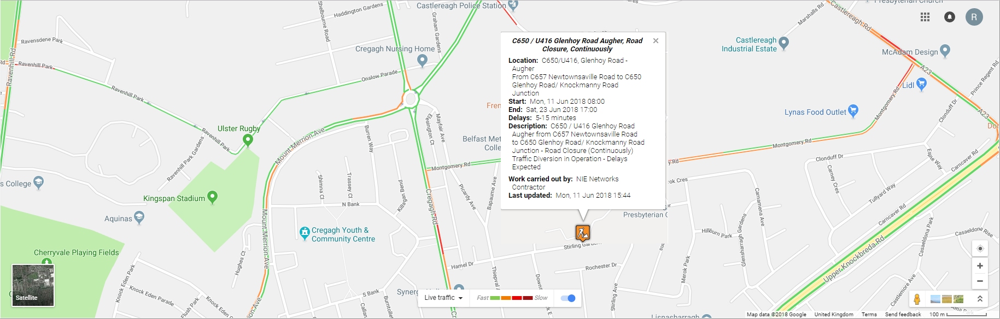

---
# 
layout: default
title: Roadworks Report | Traffic Watch Northern Ireland | nidirect
permalink: roadworks-report
---

# Roadworks Report

    

        

            <ul class="nav nav-tabs" id="tabs" role="tablist">
                <li class="nav-item">
                  <a class="nav-link active show" id="roadworks-tab" data-toggle="tab" href="#data" role="tab" aria-controls="roadworks-report" aria-selected="true">Roadworks Report</a>
                </li>
                <li class="nav-item" style="border-color:white">
                  <a class="nav-link show" id="roadworks-map" data-toggle="tab" href="#roadmap" role="tab" aria-controls="news-latest" aria-selected="true">Map View</a>
                </li>                
            </ul>
            

                

    

        

            

                

                    
 
                        

                            

                                

                                

                                
 

                            

                        

                    

                    
 
                        

                            

                                

                                    <form id="searchRoadworkForm">
                                        <fieldset>
                                            <legend>Find roadworks</legend>
                                            

                                                <select id="roadtype" name="roadType">
                                                    <option value="" selected="selected">All Roads</option>
                                                    <option value="MOTORWAY">Motorways</option>
                                                    <option value="A_ROAD">A Roads</option>
                                                    <option value="B_ROAD">B Roads</option>
                                                    <option value="OTHER">Other Roads</option>
                                                </select>
                                                <input id="todayRadio" name="period" type="radio" value="TODAY" checked="checked">
                                                <label for="todayRadio">Today</label>&nbsp;
                                                <input id="tomorrowRadio" name="period" type="radio" value="TOMORROW">
                                                <label for="tomorrowRadio">Tomorrow</label>&nbsp;
                                                <input id="rangeRadio" name="period" type="radio" value="RANGE">
                                                <label for="rangeRadio">From</label>
                                                <input id="fromDate" name="fromDate" class="search-dateInput hasDatepicker" type="text" value="" size="12" disabled="disabled"> &nbsp; To
                                                <input id="toDate" name="toDate" class="search-dateInput hasDatepicker" type="text" value="" size="12" disabled="disabled"> 

                                            
 

                                            

                                                <label for="searchText">Containing text</label>&nbsp;
                                                <input id="searchText" name="searchText" type="text" value="" size="30" maxlength="32"> &nbsp;
                                                <input id="autoRefresh1" name="autoRefresh" type="checkbox" value="true" checked="checked">
                                                <label for="autoRefresh1"> Auto-refresh results</label>
                                                <input type="hidden" name="_autoRefresh" value="on"> 

                                            

                                                <input type="submit" value="Search"> 

                                        </fieldset>
                                    </form>
                                

                                

                                    

                                        <table id="roadworkTable" summary="This table provides information on Roadworks including their location, severity and expected duration." class="table table-striped" aria-describedby="roadworkTable_info">
                                            <thead>
                                                <tr role="row">
                                                    <th class="sorting" role="columnheader" tabindex="0" aria-controls="roadworkTable" rowspan="1" colspan="1" aria-label="Map: activate to sort column ascending" style="width: 25px;">Map</th>
                                                    <th class="sorting" role="columnheader" tabindex="0" aria-controls="roadworkTable" rowspan="1" colspan="1" aria-label="Road: activate to sort column ascending" style="width: 76px;">Road</th>
                                                    <th class="sorting_disabled" role="columnheader" rowspan="1" colspan="1" aria-label="Information" style="width: 359px;">Information</th>
                                                    <th class="sorting" role="columnheader" tabindex="0" aria-controls="roadworkTable" rowspan="1" colspan="1" aria-label="Start Time: activate to sort column ascending" style="width: 29px;">Start Time</th>
                                                    <th class="sorting" role="columnheader" tabindex="0" aria-controls="roadworkTable" rowspan="1" colspan="1" aria-label="End Time: activate to sort column ascending" style="width: 29px;">End Time</th>
                                                    <th class="sorting_desc" role="columnheader" tabindex="0" aria-controls="roadworkTable" rowspan="1" colspan="1" aria-sort="descending" aria-label="Last Updated: activate to sort column ascending" style="width: 49px;">Last Updated</th>
                                                </tr>
                                            </thead>
                                            <tbody role="alert" aria-live="polite" aria-relevant="all">
                                                <tr class="roadwork Medium odd">
                                                    <td class=" "> <a href="#" onclick="changeTab()" title="Click on icon to view location on map."> 2  </a> </td>
                                                    <td class=" ">C650/U416, Glenhoy Road - Augher</td>
                                                    <td class=" "> C650 / U416 Glenhoy Road Augher, Road Closure, Continuously
                                                         
                                                        <dl>
                                                            <dt>Location</dt>
                                                            <dd>From C657 Newtownsaville Road to C650 Glenhoy Road/ Knockmanny Road Junction</dd>
                                                            <dt>Description</dt>
                                                            <dd>
                                                                
C650 / U416 Glenhoy Road Augher&nbsp;from C657 Newtownsaville Road to C650 Glenhoy Road/ Knockmanny Road Junction - Road Closure (Continuously) Traffic Diversion in Operation - Delays Expected

                                                            </dd>
                                                            <dt>Work being carried out by</dt>
                                                            <dd>NIE Networks Contractor</dd>
                                                            <dd> </dd>
                                                            <dt>Estimated delay</dt>
                                                            <dd>5-15 minutes</dd>
                                                        </dl>
                                                    </td>
                                                    <td class=" ">  Mon, 11 Jun 2018 08:00 </td>
                                                    <td class=" ">  Sat, 23 Jun 2018 17:00 </td>
                                                    <td class="  sorting_1">  Mon, 11 Jun 2018 15:44 </td>
                                                </tr>
                                                <tr class="roadwork Low even">
                                                    <td class=" "> <a href="#" onclick="changeTab()"  title="Click on icon to view location on map."> 1  </a> </td>
                                                    <td class=" ">U7512, Thomas Street - Dungannon</td>
                                                    <td class=" "> U7512 Thomas Street, Dungannon, Lane Closure, Daily 
                                                         
                                                        <dl>
                                                            <dt>Location</dt>
                                                            <dd>From 50m North of junction with Greers Road to 50m South of junction with Greers Road</dd>
                                                            <dt>Description</dt>
                                                            <dd>
                                                                
U7512 Thomas Street, Dungannon, from 50m North of junction with Greers Road to 50m South of junction with Greers Road - Lane Closure (Daily) Traffic Control in Operation - Delays Expected

                                                            </dd>
                                                            <dt>Work being carried out by</dt>
                                                            <dd>NIE Networks Contractor</dd>
                                                            <dd> </dd>
                                                            <dt>Estimated delay</dt>
                                                            <dd>Up to 5 minutes</dd>
                                                        </dl>
                                                    </td>
                                                    <td class=" ">  Tue, 12 Jun 2018 13:00 </td>
                                                    <td class=" ">  Tue, 12 Jun 2018 17:00 </td>
                                                    <td class="  sorting_1">  Mon, 11 Jun 2018 14:22 </td>
                                                </tr>
                                                <tr class="roadwork Low odd">
                                                    <td class=" "> <a href="#" onclick="changeTab()"  title="Click on icon to view location on map."> 1  </a> </td>
                                                    <td class=" ">C0663, Townview Avenue - Omagh</td>
                                                    <td class=" "> C0663 Townview Avenue, Omagh, Lane Closure, Daily-Weekdays 
                                                         
                                                        <dl>
                                                            <dt>Location</dt>
                                                            <dd>From 30m from entrance of 2 Townview Avenue (Dublin Road Side) to 30m from entrance of 2 Townview Avenue (Kelvin Road Side)</dd>
                                                            <dt>Description</dt>
                                                            <dd>
                                                                
2A Townview Avenue, Omagh, from 30m from entrance of 2 Townview Avenue (Dublin Road Side) to 30m from entrance of 2 Townview Avenue (Kelvin Road Side) - Lane Closure (Daily - Weekdays Only) Traffic Control in Operation - Delays Expected

                                                            </dd>
                                                            <dt>Work being carried out by</dt>
                                                            <dd>NI Water Contractor</dd>
                                                            <dd> </dd>
                                                            <dt>Estimated delay</dt>
                                                            <dd>Up to 5 minutes</dd>
                                                        </dl>
                                                    </td>
                                                    <td class=" ">  Tue, 12 Jun 2018 09:00 </td>
                                                    <td class=" ">  Tue, 12 Jun 2018 17:00 </td>
                                                    <td class="  sorting_1">  Mon, 11 Jun 2018 14:12 </td>
                                                </tr>
                                                <tr class="roadwork Low even">
                                                    <td class=" "> <a href="#" onclick="changeTab()"  title="Click on icon to view location on map."> 1  </a> </td>
                                                    <td class=" ">C636, Tullycullion Road - Donaghmore</td>
                                                    <td class=" "> C636 Tullycullion Road, Donaghmore, Lane Closure, Off-Peak 
                                                         
                                                        <dl>
                                                            <dt>Location</dt>
                                                            <dd>From Mullaghmore Road to Cookstown Road</dd>
                                                            <dt>Description</dt>
                                                            <dd>
                                                                
C636 Tullycullion Road, Donaghmore, from Mullaghmore Road to Cookstown Road - Lane Closure (Off-Peak Only) Traffic Control in Operation - Delays Expected

                                                            </dd>
                                                            <dt>Work being carried out by</dt>
                                                            <dd>BT Contractor </dd>
                                                            <dd> </dd>
                                                            <dt>Estimated delay</dt>
                                                            <dd>Up to 5 minutes</dd>
                                                        </dl>
                                                    </td>
                                                    <td class=" ">  Tue, 12 Jun 2018 09:30 </td>
                                                    <td class=" ">  Tue, 12 Jun 2018 16:30 </td>
                                                    <td class="  sorting_1">  Mon, 11 Jun 2018 13:58 </td>
                                                </tr>
                                                <tr class="roadwork Medium odd">
                                                    <td class=" "> <a href="#" onclick="changeTab()"  title="Click on icon to view location on map."> 2  </a> </td>
                                                    <td class=" ">A42, Mayogall Road - Clady</td>
                                                    <td class=" "> A42 Mayogall Road, Clady, Lane Closure, Off-Peak Only
                                                         
                                                        <dl>
                                                            <dt>Location</dt>
                                                            <dd>From 100m west of U5068 Mullaghnamoyagh Road to 300m east of U5068 Mullaghnamoyagh Road</dd>
                                                            <dt>Description</dt>
                                                            <dd>
                                                                
A42 Mayogall Road, Clady, from 100m west of U5068 Mullaghnamoyagh Road to 300m east of U5068 Mullaghnamoyagh Road - Lane Closure (Off-Peak Only) Traffic Control in Operation - Delays Expected

                                                            </dd>
                                                            <dt>Work being carried out by</dt>
                                                            <dd>DfI Roads Contractor</dd>
                                                            <dd> </dd>
                                                            <dt>Estimated delay</dt>
                                                            <dd>5-15 minutes</dd>
                                                        </dl>
                                                    </td>
                                                    <td class=" ">  Mon, 11 Jun 2018 09:30 </td>
                                                    <td class=" ">  Fri, 29 Jun 2018 16:00 </td>
                                                    <td class="  sorting_1">  Mon, 11 Jun 2018 11:50 </td>
                                                </tr>
                                                <tr class="roadwork Medium even">
                                                    <td class=" "> <a href="#" onclick="changeTab()"  title="Click on icon to view location on map."> 2  </a> </td>
                                                    <td class=" ">B18, Aughrim Road - Toome</td>
                                                    <td class=" "> B18 Aughrim Road, Toome, Lane Closure, Off-Peak Only
                                                         
                                                        <dl>
                                                            <dt>Location</dt>
                                                            <dd>From 200m west of U5108 Airfield Road to 200m east of U5108 Airfield Road</dd>
                                                            <dt>Description</dt>
                                                            <dd>
                                                                
B18 Aughrim Road, Toome, from 200m west of U5108 Airfield Road to 200m east of U5108 Airfield Road - Lane Closure (Off-Peak Only) Traffic Control in Operation - Delays Expected

                                                            </dd>
                                                            <dt>Work being carried out by</dt>
                                                            <dd>DfI Roads Contractor</dd>
                                                            <dd> </dd>
                                                            <dt>Estimated delay</dt>
                                                            <dd>5-15 minutes</dd>
                                                        </dl>
                                                    </td>
                                                    <td class=" ">  Mon, 11 Jun 2018 09:30 </td>
                                                    <td class=" ">  Fri, 29 Jun 2018 16:00 </td>
                                                    <td class="  sorting_1">  Mon, 11 Jun 2018 11:38 </td>
                                                </tr>
                                                <tr class="roadwork Low odd">
                                                    <td class=" "> <a href="#" onclick="changeTab()"  title="Click on icon to view location on map."> 1  </a> </td>
                                                    <td class=" ">Ballyeaston Road - Ballyclare</td>
                                                    <td class=" "> Temporary Lane Closure
                                                         
                                                        <dl>
                                                            <dt>Description</dt>
                                                            <dd>
                                                                
Temporary lane closure from Victoria Road junction to 9 Ballyeaston Road (off peak only)&nbsp; for excavation to extend Virgin Media network.

                                                            </dd>
                                                            <dt>Work being carried out by</dt>
                                                            <dd>Virgin Media</dd>
                                                            <dd> </dd>
                                                            <dt>Estimated delay</dt>
                                                            <dd>Up to 5 minutes</dd>
                                                        </dl>
                                                    </td>
                                                    <td class=" ">  Mon, 11 Jun 2018 09:30 </td>
                                                    <td class=" ">  Mon, 02 Jul 2018 16:30 </td>
                                                    <td class="  sorting_1">  Mon, 11 Jun 2018 11:13 </td>
                                                </tr>
                                                <tr class="roadwork Low even">
                                                    <td class=" "> <a href="#" onclick="changeTab()"  title="Click on icon to view location on map."> 1  </a> </td>
                                                    <td class=" ">Ballymena Road - Ballymoney</td>
                                                    <td class=" "> Temporary Lane Closure
                                                         
                                                        <dl>
                                                            <dt>Description</dt>
                                                            <dd>
                                                                
Temporary lane closure (daily) from house No 30 to junction with Carnany Gardens to connect new gas mains on behalf of Firmus Energy.

                                                            </dd>
                                                            <dt>Work being carried out by</dt>
                                                            <dd>Firmus Energy Contractor</dd>
                                                            <dd> </dd>
                                                            <dt>Estimated delay</dt>
                                                            <dd>Up to 5 minutes</dd>
                                                        </dl>
                                                    </td>
                                                    <td class=" ">  Mon, 11 Jun 2018 09:30 </td>
                                                    <td class=" ">  Thu, 14 Jun 2018 16:30 </td>
                                                    <td class="  sorting_1">  Mon, 11 Jun 2018 11:10 </td>
                                                </tr>
                                                <tr class="roadwork Low odd">
                                                    <td class=" "> <a href="#" onclick="changeTab()"  title="Click on icon to view location on map."> 1  </a> </td>
                                                    <td class=" ">A31, Magherafelt Road - Moneymore</td>
                                                    <td class=" "> A31 Magherafelt Road, Moneymore, Lane Closure,Overnight Only
                                                         
                                                        <dl>
                                                            <dt>Location</dt>
                                                            <dd>From A point 20m south-west of Gortagilly Road to A point 20m north-east of Gortagilly Road</dd>
                                                            <dt>Description</dt>
                                                            <dd>
                                                                
A31 Magherafelt Road, Moneymore, from A point 20m south-west of Gortagilly Road to A point 20m north-east of Gortagilly Road - Lane Closure (Overnight Only) Traffic Control in Operation - Delays Expected

                                                            </dd>
                                                            <dt>Work being carried out by</dt>
                                                            <dd>NI Water Contractor</dd>
                                                            <dd> </dd>
                                                            <dt>Estimated delay</dt>
                                                            <dd>Up to 5 minutes</dd>
                                                        </dl>
                                                    </td>
                                                    <td class=" ">  Mon, 11 Jun 2018 19:00 </td>
                                                    <td class=" ">  Mon, 18 Jun 2018 05:00 </td>
                                                    <td class="  sorting_1">  Fri, 08 Jun 2018 15:47 </td>
                                                </tr>
                                                <tr class="roadwork Low even">
                                                    <td class=" "> <a href="#" onclick="changeTab()"  title="Click on icon to view location on map."> 1  </a> </td>
                                                    <td class=" ">U133, Kirlish Road - Drumquin</td>
                                                    <td class=" "> U133, Bullock Park Road, Drumquin, Road Closure,Continuously
                                                         
                                                        <dl>
                                                            <dt>Location</dt>
                                                            <dd>From Kirlish Road with the Bolaght Road junction to 250meters past the Kirlish Road/Meencargagh Road junction</dd>
                                                            <dt>Description</dt>
                                                            <dd>
                                                                
U133, Bullock Park Road, Drumquin, from Kirlish Road with the Bolaght Road junction to 250meters past the Kirlish Road/Meencargagh Road junction - Road Closure (Continuously) Traffic Diversion in Operation - Delays Expected

                                                            </dd>
                                                            <dt>Work being carried out by</dt>
                                                            <dd>NIE Networks Contractor</dd>
                                                            <dd> </dd>
                                                            <dt>Estimated delay</dt>
                                                            <dd>Up to 5 minutes</dd>
                                                        </dl>
                                                    </td>
                                                    <td class=" ">  Mon, 11 Jun 2018 07:00 </td>
                                                    <td class=" ">  Fri, 22 Jun 2018 17:00 </td>
                                                    <td class="  sorting_1">  Fri, 08 Jun 2018 15:03 </td>
                                                </tr>
                                                <tr class="roadwork Medium odd">
                                                    <td class=" "> <a href="#" onclick="changeTab()"  title="Click on icon to view location on map."> 2  </a> </td>
                                                    <td class=" ">U130, Bradan Road - Drumquin</td>
                                                    <td class=" "> U130 Sloughan Road, Drumquin, Road Closure, Continuously
                                                         
                                                        <dl>
                                                            <dt>Location</dt>
                                                            <dd>From 110 Sloughan Road, Drumquin, BT78 4QN to C66 Bradan Road, Drumquin, BT78 4QQ</dd>
                                                            <dt>Description</dt>
                                                            <dd>
                                                                
U130 Sloughan Road, Drumquin, from 110 Sloughan Road, Drumquin, BT78 4QN to C66 Bradan Road, Drumquin, BT78 4QQ - Road Closure (Continuously) Traffic Diversion in Operation - Delays Expected

                                                                
&nbsp;

                                                            </dd>
                                                            <dt>Work being carried out by</dt>
                                                            <dd>NIE Networks Contractor</dd>
                                                            <dd> </dd>
                                                            <dt>Estimated delay</dt>
                                                            <dd>5-15 minutes</dd>
                                                        </dl>
                                                    </td>
                                                    <td class=" ">  Mon, 11 Jun 2018 08:00 </td>
                                                    <td class=" ">  Sat, 23 Jun 2018 17:00 </td>
                                                    <td class="  sorting_1">  Fri, 08 Jun 2018 14:08 </td>
                                                </tr>
                                                <tr class="roadwork Low even">
                                                    <td class=" "> <a href="#" onclick="changeTab()" title="Click on icon to view location on map."> 1  </a> </td>
                                                    <td class=" ">Maryville Street - Belfast</td>
                                                    <td class=" "> Road Closure
                                                         
                                                        <dl>
                                                            <dt>Description</dt>
                                                            <dd>
                                                                
Road Closure: Maryville Street, Belfast from Junction with Ormeau Avenue to Bankmore Street. Commencing Monday 11th June at 07:30 to Friday 6th July at 21:00, continuously for 4 weeks.

                                                                
Closure required for NI Water works.

                                                                
Alternate Route: Apsley Street - Bankmore Street

                                                            </dd>
                                                            <dt>Work being carried out by</dt>
                                                            <dd>NI Water</dd>
                                                            <dd> </dd>
                                                            <dt>Estimated delay</dt>
                                                            <dd>Up to 5 minutes</dd>
                                                        </dl>
                                                    </td>
                                                    <td class=" ">  Mon, 11 Jun 2018 07:30 </td>
                                                    <td class=" ">  Fri, 06 Jul 2018 21:00 </td>
                                                    <td class="  sorting_1">  Fri, 08 Jun 2018 13:44 </td>
                                                </tr>
                                                <tr class="roadwork Medium odd">
                                                    <td class=" "> <a href="#" onclick="changeTab()"  title="Click on icon to view location on map."> 2  </a> </td>
                                                    <td class=" ">Newtownbreda Road</td>
                                                    <td class=" "> Road Closure
                                                         
                                                        <dl>
                                                            <dt>Description</dt>
                                                            <dd>
                                                                
Road Closure: Newtownbreda Road, Belfast from Junction with Purdysburn Road to Roundabout close to Junction with A55 Belvoir Road - Commencing Monday 11th June at 7:00 to Friday 15th June at 20:00, continuously for 5 days.

                                                                
Required for NI Water works.

                                                                
Alternate Route: Hospital Road - Milltown Road - A55 Belvoir Road

                                                            </dd>
                                                            <dt>Work being carried out by</dt>
                                                            <dd>NI Water</dd>
                                                            <dd> </dd>
                                                            <dt>Estimated delay</dt>
                                                            <dd>5-15 minutes</dd>
                                                        </dl>
                                                    </td>
                                                    <td class=" ">  Mon, 11 Jun 2018 07:00 </td>
                                                    <td class=" ">  Fri, 15 Jun 2018 20:00 </td>
                                                    <td class="  sorting_1">  Fri, 08 Jun 2018 13:39 </td>
                                                </tr>
                                                <tr class="roadwork Medium even">
                                                    <td class=" "> <a href="#" onclick="changeTab()" title="Click on icon to view location on map."> 2  </a> </td>
                                                    <td class=" ">Linenhall Street - Belfast</td>
                                                    <td class=" "> Lane Closure
                                                         
                                                        <dl>
                                                            <dt>Description</dt>
                                                            <dd>
                                                                
Lane Closure: Linenhall Street from Ormeau Avenue to Clarence Street - Commencing Monday 4th June at 8:00 to Friday 10th August at 21:00 continuously for 10 weeks.

                                                                
Closure required for NI Water - Sewer Laying

                                                                
Alternate Route: Clarence Street, Adelaide Street

                                                            </dd>
                                                            <dt>Work being carried out by</dt>
                                                            <dd>NI Water</dd>
                                                            <dd> </dd>
                                                            <dt>Estimated delay</dt>
                                                            <dd>5-15 minutes</dd>
                                                        </dl>
                                                    </td>
                                                    <td class=" ">  Mon, 04 Jun 2018 08:00 </td>
                                                    <td class=" ">  Fri, 10 Aug 2018 21:00 </td>
                                                    <td class="  sorting_1">  Fri, 08 Jun 2018 13:15 </td>
                                                </tr>
                                                <tr class="roadwork Low odd">
                                                    <td class=" "> <a href="#" onclick="changeTab()"  title="Click on icon to view location on map."> 1  </a> </td>
                                                    <td class=" ">Loughanmore Road @ CherryHill Road - Templepatrick</td>
                                                    <td class=" "> Temporary Lane Closure
                                                         
                                                        <dl>
                                                            <dt>Description</dt>
                                                            <dd>
                                                                
Temporary lane closure from Burnside Road to Sweetwall Road - BT fault.

                                                            </dd>
                                                            <dt>Work being carried out by</dt>
                                                            <dd>BT</dd>
                                                            <dd> </dd>
                                                            <dt>Estimated delay</dt>
                                                            <dd>Up to 5 minutes</dd>
                                                        </dl>
                                                    </td>
                                                    <td class=" ">  Tue, 12 Jun 2018 09:30 </td>
                                                    <td class=" ">  Tue, 12 Jun 2018 16:30 </td>
                                                    <td class="  sorting_1">  Fri, 08 Jun 2018 11:44 </td>
                                                </tr>
                                                <tr class="roadwork Low even">
                                                    <td class=" "> <a href="#" onclick="changeTab()"  title="Click on icon to view location on map."> 1  </a> </td>
                                                    <td class=" ">B23, Malone Road - Belfast</td>
                                                    <td class=" "> Lane Closure
                                                         
                                                        <dl>
                                                            <dt>Description</dt>
                                                            <dd>
                                                                
Lane closed from Windsor Avenue to Windsor Avenue North from 09.30 hrs until 15.30 hrs daily.Weekdays only.

                                                            </dd>
                                                            <dt>Work being carried out by</dt>
                                                            <dd>Private contractor</dd>
                                                            <dd> </dd>
                                                            <dt>Estimated delay</dt>
                                                            <dd>Up to 5 minutes</dd>
                                                        </dl>
                                                    </td>
                                                    <td class=" ">  Tue, 29 May 2018 09:30 </td>
                                                    <td class=" ">  Fri, 29 Jun 2018 15:30 </td>
                                                    <td class="  sorting_1">  Thu, 07 Jun 2018 14:44 </td>
                                                </tr>
                                            </tbody>
                                        </table>
                                        
Showing 1 to 139 of 139 entries

                                    

                                

                            

                        

                    

                

            

        

    

                

                

                    
                

            

        

    

